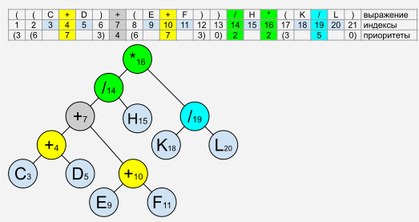

## Бинарное дерево арифметических выражений

Binary expression tree

https://en.wikipedia.org/wiki/Binary_expression_tree

Бинарное дерево арифметических выражений это структура которая позволяет вычислять в программе любые арифметические выражения с любыми математическими, логическими и побитовыми операторами с максимальной алгоритмической сложностью O(n).

Позволяет использовать приоритеты математических операторов и скобки. Например `2+2*2=6` а не `8`, `(2+2)*2=8`

### Алгоритм преобразования строки математического выражения в бинарное дерево.



1. Пронумеровать все символы. 
2. Каждому оператору присвоить приоритет.
3. Первая открывающая скобка увеличивает приоритет операторов внутри на 3
4. Следующие открывающие скобки увеличивают приоритет +3
5. Каждая закрывающая скобка уменьшает приоритет на 3
6. После расстановки всех приоритетов, корнем дерева будет самый крайний правый узел с самым низким приоритетом.
7. Сначала строим дерево из индексов операторов справа налево проходя по всем одинаковым приоритетам с самого низкого приоритета.
Например здесь начинаем строить дерево с порядком приоритетов:
> - 2[16] 2[14]
> - 4[7]
> - 5[19]
> - 7[10] 7[4]
8. После построения дерева операторов можно добавлять в него переменные справа налево, игнорировать скобки.

Скобки имеют наивысший приоритет который прибавляется к приоритетам внутри них.
Каждая открывающая скобка увеличивает приоритет на 3. Закрывающая уменьшает на 3.
Например: 
 - (a+b) приоритет плюса станет 1+3=4
 - ((a + b) * (c / d))
   - (+) = 3+3+1 = 7
   - (*) = 3+3-3+2 = 5
   - (/) = 3+3-3+3+2 = 8

Приоритеты операторов можно задавать любыми числами. Не обязательно использовать те которые приведены здесь.

Самый важный момент – приоритет скобок должен быть самым максимальным. Он должен исключать ситуации при которой сложение внутри скобок может стать равным приоритету умножения за скобками.

Данный алгоритм работает с префиксными и постфиксными операторами -a, a++,  ~a
Можно использовать побитовые и логические операторы.

<hr>
Для создания самовычисляемого дерева сделайте узлы с функцией:

```cpp
T node::calculate()
{
  return left->calculate() /*operator*/ right->calculate();
}
```
и для получения результата достаточно будет вызвать
```cpp
T result = node::root->calculate();
```

### Практическое применение

- Калькуляторы.
- Позволяет программам получать вычисляемые входные данные.

Например позволит вашей программе иметь вот такие конфигурационные файлы:
```json
"icons": [
  {
      "icon": "✅",
      "condition": "(flags & file1_available) && (file_2_not_found) && !(flags & config_installed)"
  },
  {
      "icon": "⚠️",
      "condition": "!(flags & file1_available) || (file_2_not_found) || (flags & config_installed)"
  }
]
```
Данная конфигурация сообщает программе какую иконку отображать в зависимости от большого количества условий, которые могут меняться в процессе работы.

По соей сути это динамическая исполняемая конфигурация. Почти скриптовый язык программирования.

