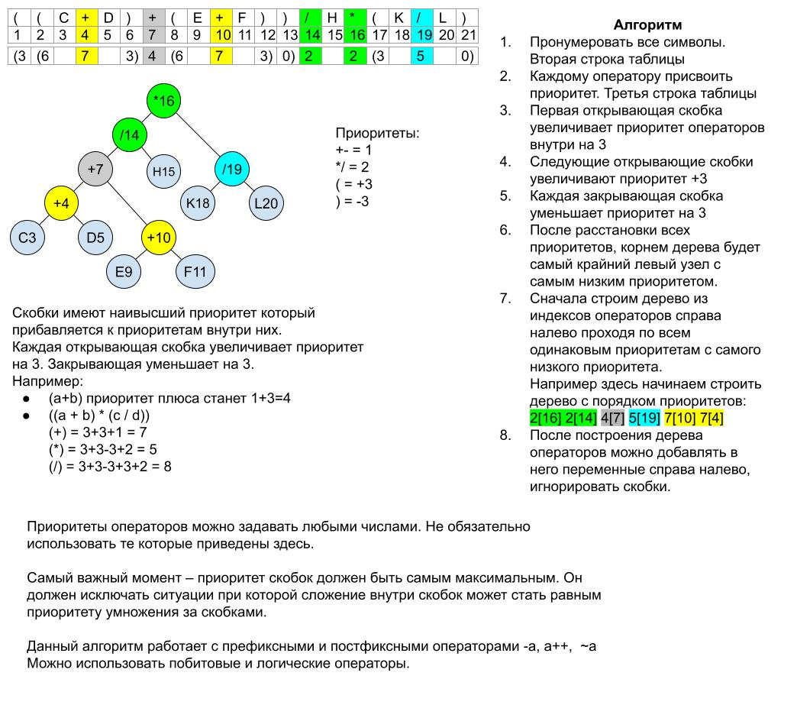

## Бинарное дерево арифметических выражений

Binary expression tree

https://en.wikipedia.org/wiki/Binary_expression_tree

Бинарное дерево арифметических выражений это структура которая позволяет вычислять в программе любые арифметические выражения с любыми математическими, логическими и побитовыми операторами с минимальной алгоритмической сложностью O(n).

Позволяет использовать приоритеты математических операторов и скобки. Например `2+2*2=6` а не `8`, `(2+2)*2=8`

### Алгоритм преобразования строки математического выражения в бинарное дерево.
<picture>
  
</picture>

Для создания самовычисляемого дерева сделайте узлы с функцией:

```cpp
T calculate()
{
  return left->calculate() /*operator*/ right->calculate();
}
```
и для получения результата достаточно будет вызвать
```cpp
T result = root->calculate();
```

### Практическое применение

- Калькуляторы.
- Позволяет программам получать вычисляемые входные данные.

Например позволит вашей программе иметь вот такие конфигурационные файлы:
```json
"icons": [
  {
      "icon": "✅",
      "condition": "(flags & file1_available) && (file_2_not_found) && !(flags & config_installed)"
  },
  {
      "icon": "⚠️",
      "condition": "!(flags & file1_available) || (file_2_not_found) || (flags & config_installed)"
  }
]
```
Данная конфигурация сообщает программе какую иконку отображать в зависимости от большого количества условий, которые могут меняться в процессе работы.

По соей сути это динамическая исполняемая конфигурация. Почти скриптовый язык программирования.

