## Бинарное дерево арифметических выражений

[Binary expression tree](https://en.wikipedia.org/wiki/Binary_expression_tree)

Бинарное дерево арифметических выражений это структура которая позволяет вычислять в программе любые арифметические выражения с любыми математическими, логическими и побитовыми операторами с максимальной алгоритмической сложностью O(n).

Позволяет использовать приоритеты математических операторов и скобки. Например `2+2*2=6` а не `8`, `(2+2)*2=8`

**Примеры бинарных деревьев элементарных выражений:**

На этом примере показан приоритет операторов и скобок:

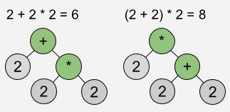

Здесь показано дерево с префиксным оператором:

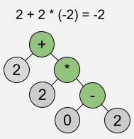

**Алгоритм анализа строки арифметического выражения**

Самый распространенный алгоритм анализа математической строки называется Shunting yard algorithm. В русском языке может иметь названия связанные с железной дорогой, такие как "сортировочная станция", "паровозное депо" итп.

Сам алгоритм довольно простой. Попытаюсь описать его простыми словами без паровозиков и вагончиков.

- Создаем два стека LIFO
    - Основной стек
    - Стек операторов

Идем по строке арифметического выражения:
 - Каждому символу присваиваем индекс. Скобки, пробелы не важно, главное чтобы новый индекс был больше предыдущего.
 - Если встречаем открывающую скобку - увеличиваем инкремент приоритета операторов (пример ниже)
 - Если встречаем закрывающую скобку - уменьшаем инкремент приоритета.
 - Если встречаем операнд - кидаем его в Основной стек.
 - Если встречаем оператор (текущий оператор) - прибавляем ему приоритет скобки.
    - Если стек операторов пустой. Кладем текущий оператор в стек операторов.
    - Если приоритет текущего оператора больше приоритета на вершине стека, кладем его в стек
    - Если приоритет текущего оператора меньше или равен приоритету на вершине стека, снимаем оператор со стека и кладем его в Основной стек. Повторяем эту операцию до тех пор пока стек операторов не опустеет или приоритет текущего оператора не станет больше чем на вершине стека. После кладем текущий оператор в стек операторов.
Если строка закончилась, перекладываем оставшиеся элементы из стека операторов в Основной стек.
- Из общего стека забираем по одному элементу и строим из них бинарное дерево. Лево-право выбираем по индексам элементов.
- Попутно можно реализовать алгоритм проверки баланса скобок.

> Так же это дерево можно строить прямо в процессе обхода строки, но тогда расти оно будет в обратном порядке от листьев к корню.
В этом случае все делается как и в алгоритме выше, только когда узел покидает стек операторов он должен забрать пару узлов из общего стека и сделать их своими потомками. После чего этот узел станет корнем дерева.
Этот метод не выигрывает по сложности. А так же незаполненный стек и недостроенное дерево наверняка вызовут трудности при анализе синтаксических ошибок, имбаланса скобок итп.

**Пример разбора математической строки в дерево.**

Для примера возьмем такое выражение:

 `((С + D) * (E + F)) / H * (K / L)`

Приоритеты операторов:
 - `+ -` 1
 - `* /` 2
 - `(` п+3
 - `)` п-3

При обходе строки все элементы выражения получат вот такие индексы и приоритеты.

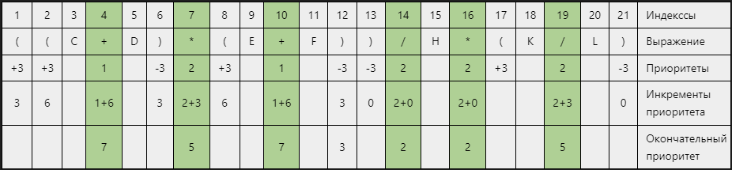

Далее стеки будут представлены в виде горизонтальных таблиц у которых левая крайняя колонка является вершиной стека.

Идем по строке, останавливаемся на каждом символе и производим разбор операций с ним.

**Индексы 1 и 2** 

- Это первые две открывающие скобки увеличивают инкремент приоритетов до 6.

**Индекс 3**

- Операнд `C`. Кладем его в Основной стек

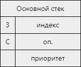

**Индекс 4**

- Оператор плюс имеет собственный приоритет равный 1 который получает инкремент от скобок +6. В итоге приоритет оператора равен 7.

- в стеке операторов ничего нет, кладем его в стек операторов:

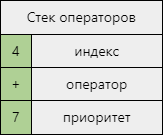

**Индекс 5**

- Операнд `D`, просто кладем его в Основной стек 
 
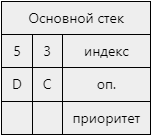

**Индекс 6**
- Закрывающая скобка уменьшает декремент приоритета на 3 и он становится равным 3.

**Индекс 7**
- Оператор умножения имеет собственный приоритет равный 2 и получает инкремент от скобок +3. В итоге приоритет оператора равен 5.

- Текущий оператор имеет приоритет меньше чем узел на вершине стека операторов. 

- Снимаем узел с вершины стека операторов и кладем его в основной стек.

- В стеке операторов снова ничего нет. Кладем текущий оператор в стек операторов.
- На данный момент оба стека будут выглядеть так:

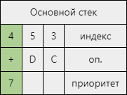

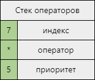

**Индекс 8** 
- это открывающая скобка. Инкремент оператора в данный момент 3 увеличивается на 3 и становится равным 6.

**Индекс 9**
- Операнд `E`, просто кладем его в Основной стек 

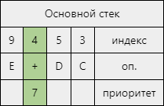

**Индекс 10**

- Оператор плюс имеет собственный приоритет равный 1 и получает инкремент от скобок +6. В итоге приоритет оператора равен 7.

- Приоритет оператора больше чем на вершине стека операторов. Кладем его в стек операторов.

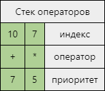

**Индекс 11**
- Операнд `F`, просто кладем его в Основной стек 

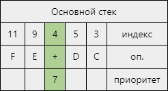

**Индексы 12 и 13**

- Две закрывающие скобки. Каждая уменьшает декремент приоритета на 3. В сумме декремент равен нулю.

**Индекс 14**

- Оператор деления. Имеет собственный приоритет 2. Декремент скобок равен нулю.
- Текущий оператор имеет приоритет меньше чем узел на вершине стека операторов. 
- Снимаем узел с вершины стека операторов и кладем его в основной стек.
- Текущий оператор всё еще имеет приоритет меньше чем узел на вершине стека операторов.
- Снимаем узел с вершины стека операторов и кладем его в основной стек.
- Стек операторов пустой, кладем текущий оператор на его вершину.
- Оба стека после обработки символа будут иметь вид:

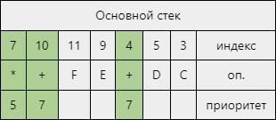

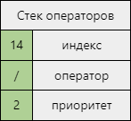

**Индекс 15**
- Операнд `H`, просто кладем его в Основной стек 

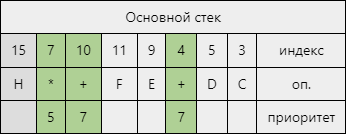

**Индекс 16**

- Оператор умножения. Имеет собственный приоритет 2. Декремент скобок равен нулю.
- Текущий оператор имеет приоритет равный узлу на вершине стека операторов. 
- Снимаем узел с вершины стека операторов и кладем его в основной стек.
- Стек операторов пустой, кладем текущий оператор на его вершину.
- Оба стека после обработки символа будут иметь вид:

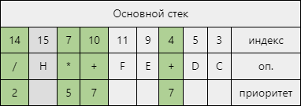

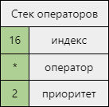

**Индекс 17**
- Открывающая скобка. Увеличивает инкремент приоритета оператора на 3.

**Индекс 18**

- Операнд `K`, просто кладем его в Основной стек 

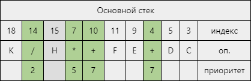

**Индекс 19**
- Оператор деления. Имеет собственный приоритет 2. Декремент скобок равен 3. Конечный приоритет равен 5.
- Приоритет оператора больше чем на вершине стека операторов. Кладем его в стек операторов.

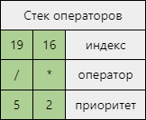

**Индекс 20**
- Операнд `L`, просто кладем его в Основной стек 

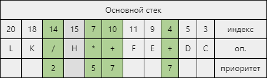

**Индекс 21**
- Закрывающая скобка. Уменьшает декремент приоритета оператора на 3. 

**Конец строки**
- В стеке операторов есть узлы. Перекладываем их в основной стек.
- Окончательно заполненный стек выглядит так:

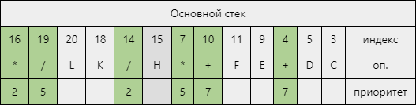

- Таблица представляет стек LIFO в котором левая колонка является его вершиной.
- Строим бинарное дерево из элементов основного стека. 
- Первый узел будет корнем дерева.
- При строительстве левые/правые узлы из индексов, который присваивался им во время обхода строки.
- Дерево строится стандартно. Большие индексы уходят вправо, меньшие  - влево.

На этом рисунке показано дерево которое у нас получилось. 

- Цифры - индексы
- Символы и буквы - операторы и операнды

- 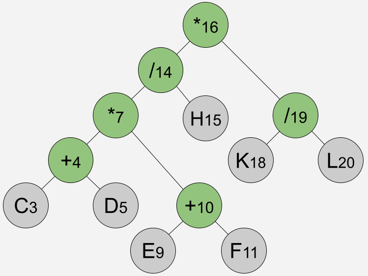

Приоритеты операторов можно задавать любыми числами. Не обязательно использовать те которые приведены здесь.

Самый важный момент – приоритет скобок должен быть самым максимальным. Он должен исключать ситуации при которой сложение внутри скобок может стать равным приоритету умножения за скобками.

